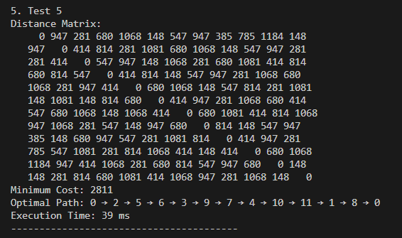

# TSP Solver with Dynamic Programming Algorithm Implementation



Implementasi algoritma Dynamic Programming (DP) untuk menyelesaikan masalah TSP.

## Struktur Proyek

```
Tucil4_13523036/
├── mix.exs              # Konfigurasi proyek Elixir Mix
├── README.md            # Dokumentasi proyek
├── lib/                 # Modul utama
│   └── tsp_solver/      # Folder untuk modul TSP Solver
│       ├── application.ex  # Modul aplikasi utama
│       ├── cli.ex          # Modul CLI untuk interaksi pengguna
│       ├── test_cases.ex   # Koleksi test cases
│       ├── test_runner.ex  # Engine untuk menjalankan test cases
│       └── tsp.ex          # Implementasi algoritma TSP
└── test/                # Unit test
    ├── test_helper.exs
    └── tsp_solver_test.exs
```

## Cara Menjalankan

### **Method 1: Build dan Run dengan Escript (Recommended)**

```bash
# Build the escript executable once
mix escript.build

# Then run it in interactive mode
./tsp_solver

# Or with specific commands
./tsp_solver all
./tsp_solver benchmark
./tsp_solver validate
./tsp_solver small
```

### **Method 2: Run dengan Mix**

```bash
# Interactive mode
mix run -e "TspSolver.CLI.main()"

# Run with specific commands
mix run -e "TspSolver.CLI.main(['all'])"
mix run -e "TspSolver.CLI.main(['benchmark'])"
mix run -e "TspSolver.CLI.main(['validate'])"
mix run -e "TspSolver.CLI.main(['small'])"
```

### **Menu Interaktif**

Interactive mode menampilkan menu dengan opsi:

1. Run all test cases
2. Run by category (small/medium/large)
3. Run by city count (3-7)
4. Benchmark analysis
5. Validate matrices
6. Custom matrix input
7. Show help
8. Exit

### **Command Line Options**

```bash
# Menjalankan semua test cases
./tsp_solver all

# Benchmark performa dengan analisis statistik
./tsp_solver benchmark

# Validasi semua matrix test cases
./tsp_solver validate

# Filter berdasarkan kategori
./tsp_solver small      # 3-4 cities
./tsp_solver medium     # 5-6 cities
./tsp_solver large      # 7+ cities

# Filter berdasarkan jumlah kota spesifik
./tsp_solver 4          # Hanya 4-city problems
./tsp_solver 5          # Hanya 5-city problems

# Bantuan
./tsp_solver help
```

## Sample Output

### **Test Case Example:**

```
Distance Matrix:
     0  12  18  24
    12   0  42  30
    18  42   0  36
    24  30  36   0
Minimum Cost: 96
Optimal Path: 0 → 1 → 3 → 2 → 0
Execution Time: 2 ms
```

## Test cases

Test cases disediakan dalam file `test_cases.ex` dan mencakup berbagai skenario untuk menguji algoritma TSP, termasuk:

```
1. Test 1
Distance Matrix:
     0  12  18  24
    12   0  42  30
    18  42   0  36
    24  30  36   0
Minimum Cost: 96
Optimal Path: 0 → 1 → 3 → 2 → 0
Execution Time: 35 ms
----------------------------------------

2. Test 2
Distance Matrix:
     0   2   2   2   2
     2   0   2   2   2
     2   2   0   2   2
     2   2   2   0   2
     2   2   2   2   0
Minimum Cost: 10
Optimal Path: 0 → 1 → 2 → 3 → 4 → 0
Execution Time: 0 ms
----------------------------------------

3. Test 3
Distance Matrix:
     0 414 1046 148 680 947 281 1081
   414   0 547 814 281 1068 148 680
   1046 547   0 414 814 281 1068 148
   148 814 414   0 547 947 281 1081
   680 281 814 547   0 414 814 281
   947 1068 281 947 414   0 547 814
   281 148 1068 281 814 547   0 414
   1081 680 148 1081 281 814 414   0
Minimum Cost: 2381
Optimal Path: 0 → 1 → 4 → 5 → 2 → 7 → 6 → 3 → 0
Execution Time: 3 ms
----------------------------------------

4. Test 4
Distance Matrix:
     0 281 680 1068 148 547 947 385 785 1184
   281   0 414 814 1081 281 680 1068 148 547
   680 414   0 547 947 148 1068 281 680 1081
   1068 814 547   0 414 814 148 547 947 281
   148 1081 947 414   0 680 1068 148 547 814
   547 281 148 814 680   0 414 947 281 1068
   947 680 1068 148 1068 414   0 680 1081 414
   385 1068 281 547 148 947 680   0 814 148
   785 148 680 947 547 281 1081 814   0 414
   1184 547 1081 281 814 1068 414 148 414   0
Minimum Cost: 2411
Optimal Path: 0 → 1 → 8 → 5 → 2 → 3 → 6 → 9 → 7 → 4 → 0
Execution Time: 14 ms
----------------------------------------

5. Test 5
Distance Matrix:
     0 947 281 680 1068 148 547 947 385 785 1184 148
   947   0 414 814 281 1081 680 1068 148 547 947 281
   281 414   0 547 947 148 1068 281 680 1081 414 814
   680 814 547   0 414 814 148 547 947 281 1068 680
   1068 281 947 414   0 680 1068 148 547 814 281 1081
   148 1081 148 814 680   0 414 947 281 1068 680 414
   547 680 1068 148 1068 414   0 680 1081 414 814 1068
   947 1068 281 547 148 947 680   0 814 148 547 947
   385 148 680 947 547 281 1081 814   0 414 947 281
   785 547 1081 281 814 1068 414 148 414   0 680 1068
   1184 947 414 1068 281 680 814 547 947 680   0 148
   148 281 814 680 1081 414 1068 947 281 1068 148   0
Minimum Cost: 2811
Optimal Path: 0 → 2 → 5 → 6 → 3 → 9 → 7 → 4 → 10 → 11 → 1 → 8 → 0
Execution Time: 47 ms
----------------------------------------

6. Test 6
Distance Matrix:
     0 1105 446 1049 754 235 646 1061 416 935 228 1122 505 694 523 280 404 721 598
   1105   0 226 404 965 1167 505 754 974 572 708 943 730 580 800 1098 904 230 835
   446 226   0 730 719 868 248 1097 817 1078 502 1001 1094 840 890 462 565 583 701
   1049 404 730   0 1127 800 653 463 716 1118 599 538 343 770 740 940 593 1184 847
   754 965 719 1127   0 253 571 665 310 974 1069 895 715 1028 212 407 350 904 580
   235 1167 868 800 253   0 586 958 182 871 1048 745 396 1055 140 342 184 720 517
   646 505 248 653 571 586   0 912 851 1000 594 925 1066 836 710 360 544 743 806
   1061 754 1097 463 665 958 912   0 1162 584 872 428 395 900 967 1157 918 1160 376
   416 974 817 716 310 182 851 1162   0 1081 713 1034 618 1142 209 314 217 598 334
   935 572 1078 1118 974 871 1000 584 1081   0 1092 306 442 652 1004 1136 1009 832 407
   228 708 502 599 1069 1048 594 872 713 1092   0 1132 552 937 852 467 697 716 842
   1122 943 1001 538 895 745 925 428 1034 306 1132   0 403 616 931 1010 930 1111 242
   505 730 1094 343 715 396 1066 395 618 442 552 403   0 890 656 517 228 948 584
   694 580 840 770 1028 1055 836 900 1142 652 937 616 890   0 797 895 962 998 434
   523 800 890 740 212 140 710 967 209 1004 852 931 656 797   0 481 204 664 568
   280 1098 462 940 407 342 360 1157 314 1136 467 1010 517 895 481   0 418 805 612
   404 904 565 593 350 184 544 918 217 1009 697 930 228 962 204 418   0 634 546
   721 230 583 1184 904 720 743 1160 598 832 716 1111 948 998 664 805 634   0 848
   598 835 701 847 580 517 806 376 334 407 842 242 584 434 568 612 546 848   0
Minimum Cost: 6410
Optimal Path: 0 → 5 → 14 → 4 → 8 → 16 → 12 → 3 → 7 → 9 → 11 → 18 → 13 → 1 → 17 → 2 → 6 → 15 → 10 → 0
Execution Time: 16558 ms
----------------------------------------
Semua test cases selesai dijalankan!
```

## Author

13523036 - Yonatan Edward Njoto
